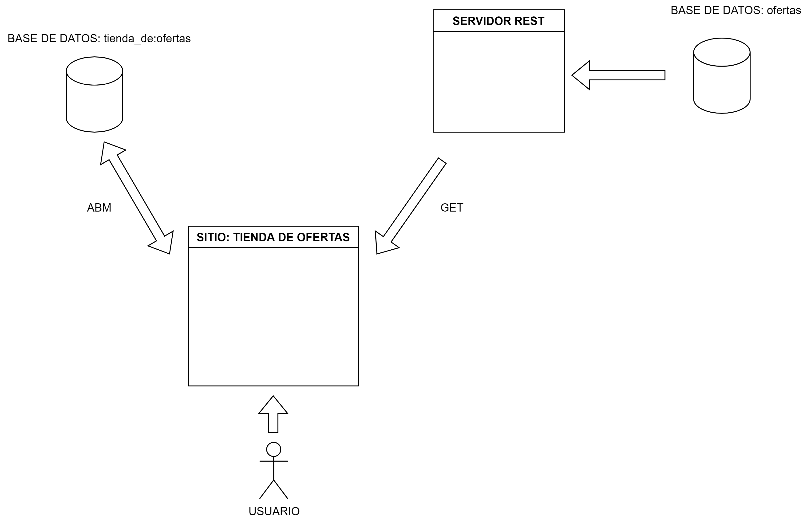
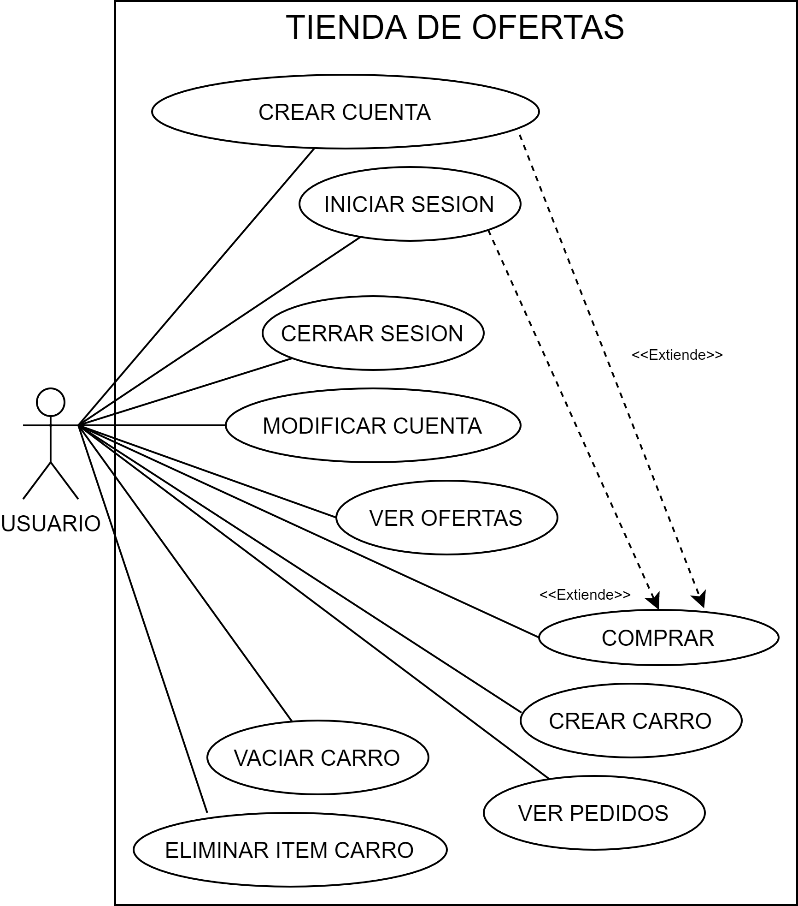
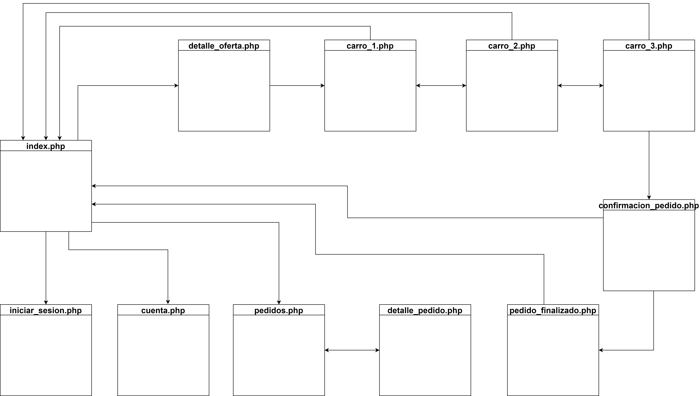
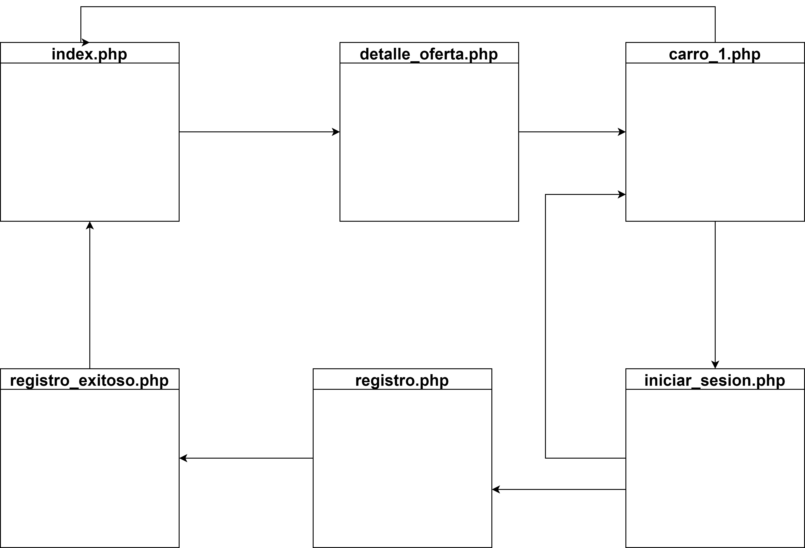
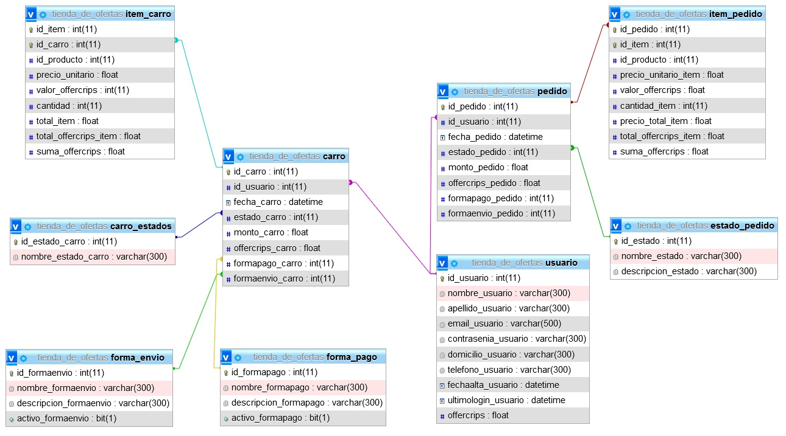
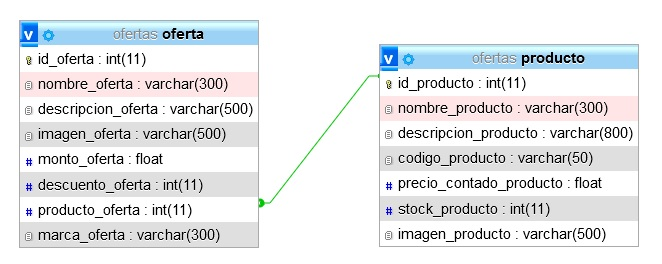

# TIENDA DE OFERTAS
INTERFACES Y PROGRAMACIÓN VISUAL - EXÁMEN FINAL

<b>“Tienda de Ofertas”</b> es una aplicación web en donde un usuario podrá registrarse para poder llevar a cabo compras de productos.
La aplicación se conecta con un servicio <b>REST</b> para obtener las ofertas disponibles. Un usuario podrá elegir una o más ofertas y comprar los productos que en ella se ofrecen (también consumidos desde el servicio REST).  
A su vez, la aplicación presenta un sistema de beneficios denominado ‘Offercrips’, de manera que, por cada usuario que se registre se le otorgará una determinada cantidad de offercrips los cuales podrá usar para abonar su pedido. También, las ofertas otorgan offercrips para acumular. La cantidad de offercrips que se ofrecen por oferta está en función del porcentaje de descuento que ofrece.  
Para el desarrollo del sistema se utilizó:
<ul>
<li>Lenguaje de programación PHP, JQuery, Javascript.</li>
<li>Diseño con HTML5, CSS3 y Bootstrap.</li>
<li>Base de datos relacional MySQL</li>
</ul>
 
A continuación, se presenta el esquema general del sitio:
 
 
 
<h2>FUNCIONES DISPONIBLES</h2>
En la aplicación, un usuario podrá: 
<ul> 
<li><b>Ver ofertas: </b>cualquier usuario, registrado o no, puede ver las ofertas disponibles.</li> 
<li><b>Registrarse: </b>darse de alta en el sistema proporcionando datos necesarios. Esta función se divide en dos pasos. Primero, el usuario ingresa un email y las contraseñas, si el email no se encuentra en el sistema, avanza al segundo paso en donde completa con la información que se le solicita. Si el proceso es correcto, se inicia una sesión (de forma implícita, es decir, sin ingresar email y contraseña). Este proceso inserta un nuevo registro en la tabla ‘USUARIO’, sólo a partir del segundo paso, durante el primer paso se usan variables de sesión. En caso de haber creado un carro de compras antes de registrarse, entonces el mismo se inserta en la tabla ‘CARRO’ y sus ítems en la tabla ‘ITEM_CARRO’.</li> 
<li><b>Iniciar sesión: </b>mediante el uso de su email y contraseña. Si los datos ingresados son correctos, se genera una sesión para tener los datos del usuario. Este proceso consulta a las tablas ‘USUARIO’ y ‘CARRO’.</li> 
<li><b>Cerrar sesión: </b>este proceso elimina la sesión activa.</li> 
<li><b>Vaciar carro:</b> durante el proceso de compra. Elimina la variable de sesión y elimina registros en las tablas ‘CARRO’ y ‘ITEM_CARRO’.</li> 
<li><b>Eliminar un ítem:</b> durante el proceso de compras, un usuario puede eliminar un ítem del listado. Se elimina un registro de la tabla ‘ITEM_CARRO’.</li> 
<li><b>Crear carro / modificar carro:</b> desde la sección “detalle_producto.php” podrá añadir a un carro existente o crear uno nuevo. Si el usuario no ha iniciado sesión, el carro queda solo en variable de sesión. Una vez iniciada la sesión, el carro junto con sus ítems se insertan en las tablas ‘CARRO’ y ‘ITEM_CARRO’ respectivamente.</li> 
<li><b>Confirmar pedido:</b> en el último paso del proceso de compra. Se crean registros en las tablas ‘PEDIDO’ y ‘ITEM_PEDIDO’. Se elimina el carro.</li> 
<li><b>Ver listado de pedidos:</b> listado accesible desde la sección “Mis pedidos”. Allí, podrá ver un listado y haciendo click sobre el número de orden, se podrá acceder al detalle del pedido. Este proceso consulta a la tabla ‘PEDIDO’ y ‘ITEM_PEDIDO’.</li> 
<li><b>Cancelar pedido:</b> desde la sección “confirmacion_pedido.php”. Este proceso elimina un registro de la tabla ‘CARRO’ y uno o varios registros en la tabla ‘ITEM_CARRO’.</li> 
  <li><b>Modificar cuenta:</b> desde la sección “Cuenta”. Actualiza un registro en la tabla ‘USUARIO’.</li>
</ul>

 A continuación, se presenta el diagrama de casos de uso: 
 

 <h2>FLUJO DE NAVEGACIÓN</h2>
Circuito de navegación para usuarios con sesión iniciada 
 
 Circuito de navegación para usuarios sin sesión iniciada
 
 

<h2>MODELO RELACIONAL</h2>
La base de datos que usa el sistema cuenta con nueve tablas:
<ul> 
  <li>USUARIO</li>
<li>CARRO</li>
<li>ITEM_CARRO</li>
<li>ESTADO_CARRO</li>
<li>PEDIDO</li>
<li>ITEM_PEDIDO</li>
<li>ESTADO_PEDIDO</li>
<li>FORMA_PAGO</li>
<li>FORMA_ENVIO</li>
 </ul>
 Y se relacionan de la siguiente manera
 

<h2>INTERACCIÓN CON EL SERVICIO REST</h2>
La aplicación interactúa con un servicio REST desde donde obtiene, por medio de una solicitud GET, las ofertas disponibles. Cuando se accede al sitio desde su página principal (index.php), se hace una solicitud GET para traer todas las ofertas. Luego, cuando se accede a una oferta en particular, se hace una solicitud GET en donde se pasa por parámetro el id_oferta. Con esa información se obtiene el detalle del producto que es usado en varias secciones del sitio. 
   
  
El modelo relacional realizado para el servicio involucra a dos tablas: OFERTA y PRODUCTO
 
  
